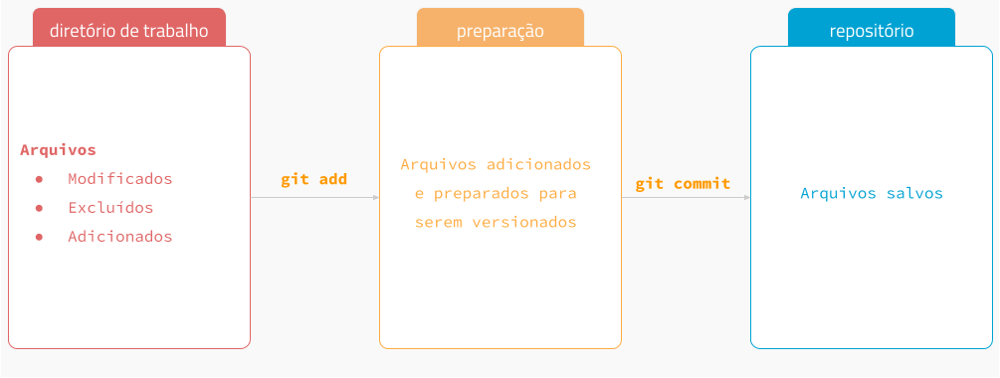

## O que é git?

Git é um sistema de controle de versão de arquivos. Através deles podemos desenvolver projetos na qual diversas pessoas podem contribuir simultaneamente no mesmo, editando e criando novos arquivos e permitindo que os mesmos possam existir sem o risco de suas alterações serem sobrescritas.

O conceito dos três estados abaixo é muito importante para o entendimento e uso do Git. Não importa o momento, seus arquivos sempre estão em um dos estados fundamentais: modificado (modified), preparado (staged) ou consolidado (committed).

Toda vez que um arquivo é salvo no controle de versão, ou seja, é registrado uma versão, o Git armazena algo parecido com uma imagem do arquivo que representa seu estado atual.

### Trabalhando em equipe

A comunicação é a chave para criar um ótimo fluxo de trabalho em equipe com o Git. O Git é versátil, flexível e acomoda uma variedade de padrões de uso. Decidir de antemão as "regras de uso" para o fluxo de trabalho ajudará a eliminar problemas e confusões, e permitirá que a equipe aproveite o que o Git faz de melhor: aumentar a produtividade.

